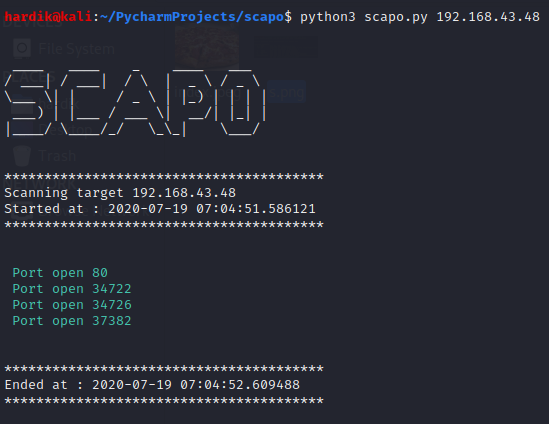

# Scapo
This a python based port scanner which tells you the open ports.

# Usage 

**git clone https://github.com/Har1743/Scapo.git**  

And then just run using  
**python3 sacpo.py host-address**

# Screenshot

# Created by

github : [Har1743](https://github.com/Har1743)
